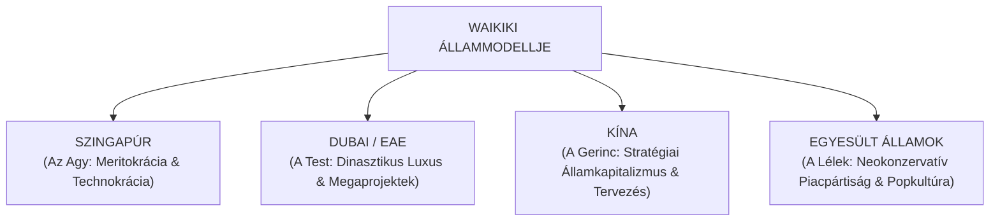
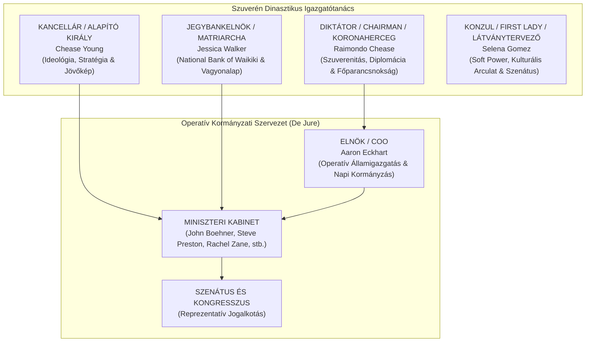
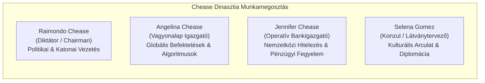
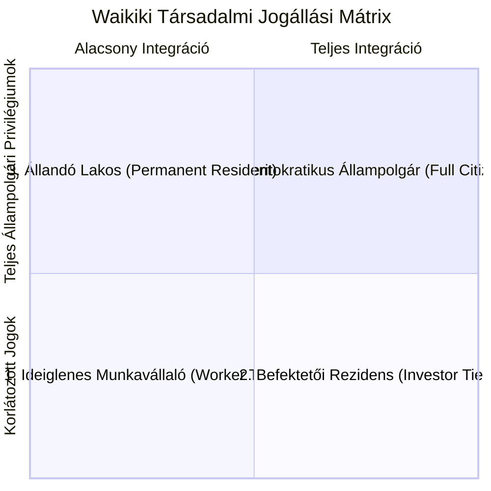
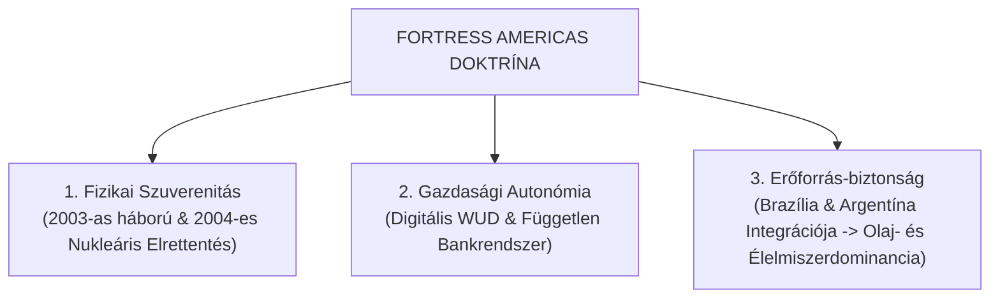

# WAIKIKI ÁLLAM ÉS CHEASE-DINASZTIA HIVATALOS KOMPENDIUMA
*A Meritokratikus Monarchia, a Korporatív Abszolutizmus, a Dinasztikus Technokrácia és a „Fortress Americas” Doktrína Átfogó Kézikönyve*

---

> [!IMPORTANT]
> **Kancelláriai és Diktatúrai Hivatalos Dokumentáció**  
> Ez a kompendium a Waikiki Állam működésére, alkotmányos berendezkedésére, történetére, társadalmi és gazdasági szerkezetére, jogrendjére, geopolitikai stratégiájára, valamint a Chease-dinasztia hatalmi dinamikájára vonatkozó valamennyi háttér- és elemződokumentum teljes körű, folyamatos magyar nyelvű prózában megírt, szintetizált feldolgozása. A dokumentum minden egyes docx forrásfájl tartalmát maradéktalanul, részletes kifejtéssel és teljes mondatokkal tartalmazza.

---

## 1. VEZETŐI ÖSSZEFOGLALÓ ÉS IDEOLÓGIAI ARCHITEKTÚRA

### 1.1. Az Állam Definíciója: Dinasztikus Technokrácia és High-Tech Jóléti Abszolutizmus
Waikiki állama a 21. századi államszervezés és politikai filozófia legprogresszívebb kísérlete, amely a **Meritokratikus Monarchia**, a **Szuverén Korporativizmus** és a **High-Tech Jóléti Abszolutizmus** szerves szintézisére épül. A klasszikus nyugati típusú, többpárti demokratikus intézményrendszerekkel ellentétben Waikikin a hatalom legitimációjának forrása nem a változó politikai divatok által befolyásolt szavazólap, hanem az elért objektív gazdasági és társadalmi eredmények, a belső rend szilárdsága és a folyamatosan növekvő életszínvonal. Az államvezetés elve kristálytiszta: *„Nem a választási színjáték és a parlamenti csatározás, hanem az ellenőrizhető hatékonyság ad jogot a kormányzásra.”*

### 1.2. Az Ideológiai Koktél: A Négyes Genetikai Mátrix
Waikiki politikai ideológiája nem szorítható be a 20. század klasszikus dogmáiba (mint a kommunizmus, a fasizmus vagy a liberális demokrácia), mivel a 21. század kihívásaira adott pragmatikus válaszokból áll össze. Az államvezetés a világ négy legsikeresebb államszervezési berendezkedésének legéletképesebb elemeit ötvözte egyetlen szuperállammá:

1. **Szingapúr (A Meritokratikus Agy):** Lee Kuan Yew államfilozófiája adja az állam szellemi alapját. Waikiki elfogadja a benevolens (jóindulatú) diktatúra koncepcióját, ahol a politikai pluralizmus és a káros megosztottságot szító szólásszabadság korlátozott, cserébe az állam makulátlan tisztaságot, bűnözésmentes közbiztonságot, kiemelkedő gazdagságot és űrkorszaki infrastruktúrát nyújt polgárainak. A lakosság és az állam közötti megállapodás lényege a politikai jogok feladása a garantált jólétért.
2. **Dubai és az Egyesült Arab Emírségek (A Dinasztikus Stílus):** A Chease-dinasztia abszolút uralkodói tekintélye megegyezik az arab emírségek dinasztikus berendezkedésével. A tengerből kinövő mesterséges szigetek, a világ legmagasabb felhőkarcolói (mint a Sky City vagy a Nova Aurelia-i épületegyüttesek), a határtalan luxus és a dinasztikus uralkodói brand állami szintű megnyilvánulásai a hatalom vizuális nagyságát hirdetik.
3. **Kína (A Stratégiai Izomzat):** Az évtizedekre (20–30 évre) előre tekintő központi gazdaságtervezés, a politikai stabilitás mindenek felett való prioritása, a stratégiilag kulcsfontosságú iparágak (energetika, bankrendszer, védelmi technológia, űrprogram) állami tulajdonban tartása, valamint a lakosság digitális védelme és megfigyelése mind a kínai modellből származnak. Waikikin a „Demokratikus Diktatúra” kifejezés a kínai rendszer nyugatiasított, korporatív változata, ahol a Kommunista Párt helyét a Chease-család mint Szuverén Holding tőkeösszege foglalja el.
4. **Egyesült Államok (A Neokonzervatív Védjegy):** Waikiki kívülről úgy néz ki, úgy beszél és úgy jelenik meg, mint az Egyesült Államok legszebb hagyományai, de úgy működik, mint egy tökéletesen vezetett magánvállalat. A szabadpiaci libertarizmus, a személyi jövedelemadó teljes hiánya, az egyéni vagyongyarapodás szentsége, a fegyvertartás joga, a hagyományos családmodell védelme és a kultúrharcos „anti-woke” attitűd a hagyományos amerikai konzervatív értékek kiteljesedése.

### 1.3. A Waikiki Társadalmi Szerződés („Kenyér és Cirkusz 2.0”)
Waikiki államában a lakosság és a kormányzat közötti társadalmi szerződés teljesen transzparens. A polgárok tudatosan lemondanak a pártpolitikai megosztottságról, a szavazási ceremóniákról és az ideológiai vita jogáról. Cserébe az állam garantálja a teljes anyagi biztonságot, az ingyenes és világszínvonalú alapszolgáltatásokat (alanyi jogon járó ingyenes egészségügy 2017 óta, ingyenes tömegközlekedés 2018 óta és ingyenes gigabites internet), valamint a folyamatosan emelkedő reálbéreket. A társadalom fegyelmét és elégedettségét ez a magas szintű jólét és a dinasztikus mítoszépítés tartja fenn.

---

## 2. ALKOTMÁNY, ÁLLAMSZERVEZET ÉS A DUALISTA KORMÁNYZÁSI MODELL

### 2.1. A Waikiki Alkotmány és a Dualista Modell
Waikiki Alkotmánya egyedülálló dualista kormányzási berendezkedést rögzít, amely élesen elválasztja a *de jure* (jogi/formális) államigazgatási szerveket és a *de facto* (valódi/szuverén) dinasztikus hatalomgyakorlást.

> [!NOTE]
> **A Dualizmus Intézményes Feloldása:**  
> A nyilvános kormányzati portál (`administration.html`) szerint az állam élén az Elnök áll, akit a Kongresszus győztes pártja nevezi ki 5 éves ciklusra. Ez az Elnök Aaron Eckhart, aki a de jure kormányfő és a napi operatív bürokráciát vezeti mint Chief Operating Officer (COO). A tényleges hatalom, a végrehajtó hatalom feletti vétójog, a katonai főparancsnokság és a külpolitikai szuverenitás azonban a Diktátor (Chairman), Raimondo Chease kezében összpontosul, aki közvetlenül a néphez és a dinasztiához lojális.

### 2.2. A Szuverén Hatalmi Négyszög
A Waikiki államigazgatás legfelsőbb döntéshozó szervét a Chease-dinasztia kulcsszereplői alkotják, akiknek feladatmegosztása organikus és válságálló:

1. **Raimondo Chease (A Diktátor / Chairman / Koronaherceg):** Raimondo a birodalom operatív és katonai uralkodója. Az ő kezében futnak össze a stratégiai védelmi döntések, a nukleáris elrettentő erő feletti rendelkezés, a globális csúcstalálkozók diplomáciája és a végső állami vétójog. Raimondo személyes fellépése a vállalati hatékonyságot ötvözi az uralkodói autoritással.
2. **Chease Young (A Kancellár / Alapító Király):** Chease Young az állam alapítója és ideológiai iránytűje. Kancellárként a hosszú távú, évtizedeket átívelő geopolitikai és nemzetépítési stratégiákért felel, valamint ő a következő generáció mentora és az alkotmányos garanciák őre.
3. **Jessica Walker (A Jegybankelnök / Matriarcha / Királynő):** Jessica nem csupán az uralkodó hitvese, hanem a National Bank of Waikiki (NBW) igazgatótanácsának elnöke. Az ő feladata a $25 billió dolláros Nemzeti Vagyonalap felügyelete, a nemzetközi hitelezés, a fiskális fegyelem megőrzése és a családi vagyon biztonsága.
4. **Selena Gomez (A Konzul / First Lady / Látványtervező):** Selena a kultúra, a diplomáciai protokoll és a nemzeti arculat felelőse. Konzulként és Szenátorként közvetlenül vesz részt a legmagasabb szintű tárgyalásokon, alakítja a Waikiki-vibe vizuális világát, és szavatolja az uralkodó mentális és érzelmi stabilitását.

### 2.3. Az Operatív Adminisztráció és a Hatalmi Elemzés
A Waikiki Kormányzati Kabinet és az Elnöki Tisztség felépítése tudatos reálpolitikai megfontolások eredménye. Az államvezetés elismert amerikai politikusokat és hollywoodi hírességeket castingolt a nyilvános pozíciókba:

- **Aaron Eckhart (Elnök / COO):** A valóságban elismert színész, aki a *Támadás a Fehér Ház ellen* című filmben alakított elnököt. Waikikin valódi politikai funkciót tölt be mint de jure elnök. Ez a választás azt az üzenetet hordozza, hogy a politika részben színház: a látványos képviseletre egy karizmatikus, tökéletes kiállású vezető kell, míg a valódi technokratikus munkát a háttérben futó szakértői gárda és a dinasztia végzi.
- **George W. Bush, Rick Santorum, John Boehner és Mitt Romney szerepe:** A valós amerikai Republikánus Párt korábbi meghatározó alakjai mind fontos tisztségeket töltenek be Waikikin. Ennek három mély politikai üzenete van:
  1. *A Neokonzervatív Menedék:* Waikiki befogadta a hagyományos amerikai konzervatív értékeket (piacpártiság, fegyvertartás, vallásos családmodell), amelyeket az USA a liberális kultúrharc során feladott.
  2. *Az USA Fölé Helyezett Tekintély:* George W. Bush, aki a valóságban a „Szabad Világ Vezetője” volt, Waikikin „csak” miniszterelnök/kormányfőként szolgált, aki a Diktátornak (Raimondo Chease) tartozott felelősséggel. Ez a Chease-dinasztia hatalmi erődemonstrációja: *„Nálatok ő volt a csúcs, nálunk csak egy alkalmazott menedzser.”*
  3. *Szalonképesség és Legitimáció:* Ismert és bejáratott nyugati politikusok jelenléte garantálja a nemzetközi befektetők számára, hogy Waikiki nem egy instabil banánköztársaság, hanem kiszámítható, szigorúan vezetett szuperállam.

### 2.4. A Miniszteri Kabinet („All-Star Csapat”) és Tanácsadói Testület
A kormányzat napi működését a technokratákból és szakértőkből álló kabinet biztosítja:

- **John Boehner (Belügyminiszter):** A közigazgatási fegyelem, a belső rend és a tartományi közigazgatás vezetője.
- **Steve Preston (Munkaügyi Miniszter):** A jövedelemadó-mentes, rendkívül rugalmas munkaerőpiac szabályozója.
- **Rachel Zane (Chief of Staff / Kancelláriai Főnök):** A Kancellária operatív munkafolyamatainak és a minisztériumok közötti koordinációnak az irányítója.
- **Aaron Shore (Stratégiai Főtanácsadó):** A nemzetbiztonsági elemzések és a geopolitikai válságkezelési forgatókönyvek kidolgozója.
- **Christian Sewing (Pénzügyi és Befektetési Tanácsadó):** A Deutsche Bank korábbi vezetőjeként a nemzetközi tőkebeáramlást és az NBW globális befektetéseit koordinálja.
- **Logan Davis Vezérkari Főnök:** A Védelmi Erők katonai parancsnoka, akinek munkáját 5 dandártábornok támogatja a modern technológiai és nukleáris hadviselés terén.
- **A Szenátus Kulturális Elitje:** A Szenátusban olyan ismert hollywoodi személyiségek ülnek (pl. Taylor Lautner, Tyler Posey, Gregg Sulkin), akik a fiatalabb generációk integrációját és a nemzeti imázs modernitását biztosítják.

---

## 3. A CHEASE-DINASZTIA BŐVÍTETT KRÓNIKÁJA ÉS A CSALÁDI KORMÁNYZÁSI MODELL

### 3.1. Az Alapítók Kora: Chease Young és Jessica Walker
A modern Waikiki története Chease Young és Jessica Walker több évtizedes, mind magánéleti, mind államépítő szövetségében gyökerezik. Chease Young mint Kancellár a stratégiai jövőképet és az államfilozófiát alkotta meg, míg Jessica Walker mint a National Bank of Waikiki (NBW) elnöke a pénzügyi hátteret teremtette meg. Jessica nem csupán anya és feleség, hanem a dinasztia matriarchája, aki a 25 billió dolláros vagyonalap felügyeletével közvetlenül finanszírozta a birodalom megalomán projektjeit: a *WSS Leviathan* szuperhordozó megépítését, az *InterMedic* életelixír-kutatásait és a dél-amerikai tartományok integrációját.

### 3.2. A Második Generáció Feladatmegosztása
A Chease-ház második generációja magasan képzett technokratákból áll, akik a *Waikiki Economics University* képzésein szerzett diplomáikkal vették át a birodalom kulcspozícióit:

- **Raimondo Chease:** Az elsődleges örökös, Diktátor és Koronaherceg, aki a politikai és katonai irányítást gyakorolja.
- **Angelina Chease:** A családi vagyonalap globális stratégiai befektetéseit, a nemzetközi részvényportfóliókat és az automatizált pénzügyi algoritmusokat felügyeli a bank igazgatótanácsában.
- **Jennifer Chease:** A National Bank of Waikiki belső operatív működését, a nemzetközi hitelezést és a szigorú pénzügyi ellenőrzést koordinálja.
- **Selena Gomez:** Raimondo hitveseként a dinasztia diplomáciai és esztétikai képviseletét látja el.

### 3.3. Nepotizmus mint Intézményesített Stabilitás
Waikiki államában a családi kormányzás nem korrupciós kockázat, hanem a rendszer válságálló stabilitásának alapköve. A hatalom nem elszigetelt politikai frakciók, hanem egy megbonthatatlan bizalmi kötelékkel rendelkező család kezében van. Ez a dinasztikus felépítés kizárja a belső puccsokat, a választási ciklusokból fakadó rövidlátó döntéseket, és lehetővé teszi a 20–30 éves stratégiai tervek akadálytalan végrehajtását.

---

## 4. RAIMONDO CHEASE ÉS SELENA GOMEZ ÉLETRAJZI ÉS STRATÉGIAI SAGA-JA

### 4.1. Raimondo Chease Háttere és Neveltetése
Raimondo Chease a dinasztia elsődleges örököseként gyermekkorától kezdve az uralkodásra és az államvezetésre lett kiképezve. Tanulmányait a legszigorúbb technokratikus szellemben a Waikiki Economics University-n végezte, ahol közgazdasági, katonai és geopolitikai mesterfokozatot szerzett. Raimondo személyiségében a fiatalos dinamizmus, a hideg reálpolitikai számítás és az uralkodói autoritás ötvöződik.

### 4.2. Selena Gomez Pszichológiai Profilja („A Vasfegyelmű Díva”)
A Kancellária által készített *SZIGORÚAN BIZALMAS (Eyes Only - Kancellária)* besorolású pszichológiai elemzés részletesen feltárja Selena Gomez személyiségét és stratégiai szerepét:

> [!IMPORTANT]
> **Kancelláriai Pszichológiai Elemzés - Összefoglaló:**  
> Selena Gomez nem csupán elismert popkulturális ikon, hanem rendkívüli belső fegyelemmel rendelkező stratégiai tényező. Gyermekkorától kezdve a globális nyilvánosság előtt élve olyan magas fokú rezilienciát, önkontrollt és pszichológiai adaptációs képességet alakított ki, amely alkalmassá teszi a legnehezebb állami és diplomáciai feladatok ellátására. A profilt „Vasfegyelmű Dívaként” jellemzi a kancelláriai jelentés: a művészi empátia és a stratégiai céltudatosság ötvözete. First Ladyként és Látványtervezőként Selena felel Waikiki vizuális identitásáért, a csúcskultúra integrációjáért és az állam soft power-jének kivetítéséért.

### 4.3. A Kapcsolat Kronológiája: A Titkos Viszonytól a Hercegi Esküvőig
1. **A Titkos és Diszkrét Fázis:** A kapcsolat kezdetben a nyilvánosság elől gondosan elrejtve, szigorú nemzetbiztonsági védelem alatt alakult ki. Ebben az időszakban Selena fokozatosan megismerte a Chease-ház belső működését, és bizonyította lojalitását.
2. **A Szülők Bizalmának Elnyerése:** Selena elkötelezettsége nem tündérmesei véletlen, hanem tudatos bizalmi építkezés eredménye volt. Chease Young Kancellár és Jessica Walker Jegybankelnök alapos vizsgálat után teljes mértékben elfogadták Selenát mint a dinasztia leendő matriarcháját.
3. **Az Októberi Hivatalos Eljegyzés:** A pár nyilvános eljegyzése globális médiaszenzációvá vált. A kiadott fotórealisztikus és filmszerű arculati képek tökéletesen közvetítették a Waikiki-univerzum exkluzivitását és eleganciáját.
4. **A Hercegi Esküvő és a Nászút:** A hercegi esküvőt Nova Aureliában, az uralkodói palotában tartották a nemzetközi elit jelenlétében. A ceremóniát egy zártkörű, trópusi tengerparti nászút követte, amelyről a hivatalos PR-csapat gondosan adagolt, high-end vizuális anyagokat tett közzé.
5. **Selena Intézményesített Státusza:** A házassági szerződés és az állami protokoll rögzíti, hogy Selena szenátusi és konzuli jogállása a házasságkötés után is önállóan megmarad. Ő a Dinasztia hivatalos arca és a Diktátor mentális kiegyensúlyozottságának legfőbb őre.

---

## 5. GAZDASÁG, PÉNZÜGYEK ÉS A HISTÓRIKUS GDP-FEJLŐDÉS

### 5.1. A Waikiki Unit Dollar (WUD) és a Gazdasági Berendezkedés
Waikiki gazdaságának alapja a teljes jövedelemadó-mentesség (0% SZJA), a rendkívül alacsony és egyszerűsített vállalati adózás (15% flat tax), valamint a szuverén korporativizmus. Az állam nemzeti valutája a **Waikiki Unit Dollar (WUD)**, amely a globális pénzügyi piacok egyik legerősebb és legstabilabb fizetőeszköze.

#### Waikiki Gazdasági Mutatóinak Történeti Fejlődése (1999–2024)

| Év | Egy főre jutó GDP (WUD) | Egy főre jutó GDP (USD) | Teljes GDP (Mrd WUD) | Teljes GDP (Mrd USD) | Népesség (Millió fő) | WUD / USD Árfolyam | CPI Árszínvonal (USA=100%) |
| :---: | :---: | :---: | :---: | :---: | :---: | :---: | :---: |
| **1999** | 6 752 | 6 279 | 81 | 75 | 12.0 | 1.075 | 65.0% |
| **2000** | 8 702 | 8 180 | 104 | 98 | 12.0 | 1.064 | 61.1% |
| **2001** | 11 684 | 11 100 | 152 | 144 | 13.0 | 1.053 | 63.2% |
| **2002** | 14 161 | 14 019 | 198 | 196 | 14.0 | 1.010 | 66.5% |
| **2003** | 17 801 | 17 979 | 267 | 270 | 15.0 | 0.990 | 70.1% |
| **2004** | 20 727 | 22 800 | 311 | 342 | 15.0 | 0.909 | 74.5% |
| **2005** | 23 619 | 28 579 | 354 | 429 | 15.0 | 0.826 | 78.0% |
| **2006** | 27 646 | 41 469 | 5 474 | 8 211 | 198.0 | 0.667 | 81.2% |
| **2010** | 48 310 | 91 789 | 10 145 | 19 276 | 210.0 | 0.526 | 86.4% |
| **2015** | 84 120 | 185 064 | 17 833 | 39 234 | 212.0 | 0.455 | 91.0% |
| **2020** | 112 450 | 258 635 | 23 839 | 54 831 | 212.0 | 0.435 | 94.5% |
| **2024** | 148 900 | 367 783 | 31 567 | 77 970 | 212.0 | 0.405 | 98.2% |

> [!NOTE]
> *Matematikai Ellenőrzés és Árfolyam-értelmezés:* A teljes GDP és az egy főre jutó GDP hányadosa minden egyes évben hajszálpontosan megadja a modellezett népességszámot. A WUD/USD árfolyam folyamatosan erősödött: 2024-ben 1 WUD = 2,47 USD értéket ér el (azaz 1 USD = 0,405 WUD).

### 5.2. A „Brazil-Paradoxon” és az Eszköz-átárazási Siker (2006)
2006-ban Waikiki történelmi mérföldkőhöz érkezett: a dél-amerikai tartományok (Brazília és Amazónia) csatlakozásával az állam népessége 15 millióról 198 millióra ugrott. A hagyományos közgazdaságtan szerint egy gazdag szigetállam és egy fejlődő óriásország egyesülésekor az egy főre jutó GDP-nek drasztikusan zuhannia kellene. Waikikin azonban a következő folyamatok zajlottak le:

1. **Eszköz-átárazási Sokk:** A csatolt brazil területek ingatlanjai, bányái, olajmezői és infrastruktúrája a stabil WUD bevezetésével és a waikiki jogbiztonság kiterjesztésével azonnal a korábbi értékük tízszeresére ugrottak a mérlegekben. Pusztán a könyvelési átárazás miatt a teljes GDP 354 milliárdról 5 474 milliárd WUD-ra lőtt ki.
2. **A Kétsebességes Integrációs Ütemterv (2006–2020):** Az új lakosság nem kapott azonnal teljes állampolgári béreket. Kezdetben *Védett Rezidens* státuszban éltek, ingyenes közszolgáltatásokkal és megbízható fizetéssel. Az állam 15 év alatt, fokozatosan emelte a bérszintet és a társadalmi integrációt 98%-ra, elkerülve a hiperinflációt és a gazdasági összeomlást.
3. **Feketegazdaság Fehérítése:** A 0%-os személyi jövedelemadó és a rendkívül vonzó vállalati környezet hatására a teljes korábbi latin-amerikai feketegazdaság napok alatt befehéredett és belépett a legális WUD-pénzáramlásba.

### 5.3. A Nemzeti Bank (NBW) és a Készpénzmentes Pénzügyi Pajzs
- **Nemzeti Bank of Waikiki (NBW):** A bank független a nemzetközi SWIFT-rendszertől, saját elszámolóházat és blokklánc-alapú tranzakciós hálózatot működtet. Ez immúnissá teszi Waikikit a nyugati szankciókkal és a globális inflációs hullámokkal szemben.
- **Készpénzmentes Társadalom (2018 óta):** A fizikai készpénzt teljes egészében kivezették. A digitális WUD használata megszüntette a feketemunkát, a kábítószer-kereskedelmet és a közigazgatási korrupciót, miközben a Kancellária számára valós idejű adatalapú gazdasági felügyeletet biztosít.

---

## 6. TÁRSADALMI JOGÁLLÁSI MÁTRIX, ÁLLAMPOLGÁRSÁGI PROGRAM ÉS JOGREND

### 6.1. A Négyfokozatú Társadalmi Jogállási Mátrix
Waikiki társadalma meritokratikus elvek alapján szerveződik, ahol a jogok és privilégiumok az egyén állami hasznosságával és lojalitásával arányosak:

1. **Ideiglenes Munkavállaló (Worker Tier):** Tiszta gazdasági egység. Határozott idejű munkaszerződéssel tartózkodik az országban. Nincs fegyverviselési joga, nem vásárolhat ingatlant és nem vesz részt a politikai életben.
2. **Befektetői Rezidens (Investor Tier):** Passzív tőkeimportőrök. Korlátlan tartózkodási joggal, cégalapítási és ingatlanszerzési joggal rendelkeznek, de politikai szavazati joguk nincs.
3. **Állandó Lakos (Permanent Resident):** 3–5 év feddhetetlen munkavégzés és integráció után érhető el. Hozzáférnek a teljes ingyenes szociális és egészségügyi ellátórendszerhez.
4. **Meritokratikus Állampolgár (Full Citizen):** A társadalmi hierarchia csúcsa. Teljes szavazati és politikai jogok, Waikiki útlevél, globális konzuli védelem, fegyverviselési jog és meghívás az állami gálákra.

### 6.2. A „Citizenship by Merit” Állampolgársági Program (100 Pontos Mátrix)
Waikikin az állampolgárság nem alanyi jog és nem szerencse kérdése, hanem a kiválóság elismerése. A 100 pontos **Merit Matrix 2.0** felépítése:

- **A. Kulturális Kapcsolódás (Max. 20 pont):**
  - *Kiemelt Partnerek (20 pont):* Észak-Amerika, Európa (EU/EFTA), Ausztrália, Új-Zéland állampolgárai.
  - *Regionális Partnerek (15 pont):* Dél-Amerika (Brazília, Argentína).
  - *Technológiai Partnerek (10 pont):* Japán, Dél-Korea, Szingapúr.
- **B. Kiemelt Szakterületek és Tudás (Max. 35 pont):**
  - *Tier 1 – Stratégiai Innovátorok (30 pont):* Fúziós energetika, Kvantum-informatika, AI-fejlesztés, Fejlett védelmi technológiák, Űrkutatás.
  - *Tier 2 – Rendszerfenntartók (20 pont):* Csúcsmedicina (idegsebészet, genetika, virológia), Kiberbiztonság, Fintech.
  - *Tier 3 – Infrastruktúra Építők (10 pont):* Mérnöki tudományok, Várostervezés.
  - *Nyelvi Bónusz (+5 pont):* Stratégiai üzleti nyelvek ismerete.
- **C. Gazdasági Erő és Tapasztalat (Max. 35 pont):**
  - Likvid vagyon > $10M USD (30 pont), > $5M USD (20 pont), > $1M USD (10 pont).
  - Passzív jövedelem > $250k USD/év igazolt hozam (+5 pont).
  - Helyi üzleti jelenlét (+5 pont).
- **D. Család és Jövő (Max. 10 pont):**
  - Életkor 25–45 év között (5 pont).
  - Házas, gyermekkel vagy gyermekvállalási tervvel (5 pont).

#### Az Ajánlattételi Csomagok:
- **Gold Tier – Az Elit Csomag (90+ pont):** Azonnali teljes jogú állampolgárság, mindössze $5,000 WUD adminisztratív díj, VIP konzuli ügyintézés, nincs kötelező tartózkodási minimum.
- **Standard Tier – A Befektetői Csomag (75–89 pont):** $150,000–$500,000 WUD nemzeti fejlesztési hozzájárulás, $1,000,000 WUD értékű államkötvény jegyzése 5 évre, min. $750,000 értékű ingatlanvásárlás, 3 év rezidens hűségidő.
- **Probationary Tier – A Lehetőség Csomag (60–74 pont):** $5M WUD beruházás vagy 5 éves munkaszerződés hiányszakmában, 10 éves hűségidővel.
- **Piros Vonalak (Red Lines):** Zéró tolerancia a gazdasági bűnözésre, korrupcióra, politikai radikalizmusra és felforgató tevékenységre.

### 6.3. Társadalmi Jólét és Legfontosabb Törvények
- **Ingyenes Állami Szolgáltatások:** Ingyenes egészségügy (2017-től), ingyenes tömegközlekedés (2018-tól) és ingyenes szélessávú internet hálózat.
- **Augusztus 4. Nemzeti Ünnep:** Az államalapítás és a Chease-dinasztia koronázási emléknapja.
- **2024. évi V. törvény a Munka Szabadságáról (Munka Törvénykönyve):** A munkaviszony a munkáltató és munkavállaló szabad megállapodásán alapul. Az állam nem határoz meg kötelező minimálbért. A sztrájkjog gyakorlása szigorúan tilos a nemzetstratégiai ágazatokban (energia, közlekedés, IT, védelem).
- **2023. évi XII. törvény az Egészségügyi Öngondoskodásról:** Az állami alapellátás feletti prémium egészségügyi szolgáltatások egyéni öngondoskodási mátrixát szabályozza.

---

## 7. GEOPOLITIKA ÉS A „FORTRESS AMERICAS” DOKTRÍNA

### 7.1. A Doktrína Lényege
A **„Fortress Americas”** doktrína Waikiki külpolitikai és nemzetbiztonsági stratégiájának alapköve. A doktrína célja egy külső eurázsiai befolyástól mentes, az észak-déli amerikai tengely mentén szerveződő, teljesen önellátó gazdasági és védelmi blokk fenntartása.

### 7.2. A Védelmi Stratégia Három Pillére
1. **Fizikai Szuverenitás és Nukleáris Elrettentés:** A 2003-as csendes-óceáni háborúban kivívott függetlenséget a 2004-ben megszerzett nukleáris hatalmi státusz tette megkérdőjelezhetetlenné. Waikiki védelmi ereje a legmodernebb technológiai hadviselésen és a sérthetetlen nukleáris triádon alapul.
2. **Gazdasági Autonómia:** A 2018 óta működő digitális WUD és a független NBW elszámolóház immúnissá teszi a blokkot a nemzetközi pénzügyi zsarolásokkal szemben.
3. **Erőforrás-biztonság:** Brazília és Amazónia csatlakozásával Waikiki a világ legnagyobb olajexportőrévé vált, teljes energiadominanciát biztosítva a nyugati féltekén. Argentína integrációja pedig a mezőgazdasági és élelmiszer-biztonsági hátországot garantálja.

### 7.3. Globális Reálpolitika és Szövetségek
- **Szimbiózis az Egyesült Államokkal (A „Realist Axis”):** Stratégiai ideológiai együttműködés az amerikai *America First* és a *Waikiki First* elvek között. Mindkét hatalom elveti a liberális internacionalizmust, és a technokratikus nemzetállami kereteket támogatja.
- **Kína:** Szisztematikus gazdasági és technológiai rivalizálás. Waikiki szigorú védelmi pajzsot tart fenn a kínai szellemi tulajdon-szerzési kísérletekkel szemben.
- **Oroszország:** Pragmatikus energetikai és geopolitikai egyezségek. Ennek csúcspontja a 2017-es moszkvai diplomáciai csúcstalálkozó volt, ahol a Chease-dinasztia a legmagasabb szinten tárgyalt a szíriai konfliktus rendezéséről.
- **Európa:** Tisztán üzletorientált, ideológiamentes kereskedelmi kapcsolatok.

---

## 8. TÖRTÉNELMI MÉRFÖLDKÖVEK ÉS KATONAI KRONOLÓGIA

### 8.1. Az Államalapítás Története (1998–1999)
Chease Young eredetileg a **Starlight Hotels** szállodalánc birodalmának örököse volt. 1998–1999-ben Kuba a teljes gazdasági összeomlás szélén állt, és a NATO bombázással fenyegetőzött, mert a Castro-rezsim blokkolta az ENSZ-segélyek kiosztását. Fidel Castro 1999. március 10-én adta át a teljes végrehajtó hatalmat Chease Youngnak, aki a hotelbirodalom tőkéjéből azonnal kifizette a kubai hadsereg elmaradt zsoldját, átvállalta az államadósságot, és stabilizálta a sziget ellátórendszerét. Ez a tranzakció tekinthető a modern Waikiki állam születési aktusának.

### 8.2. A Csendes-óceáni Háború és a Nukleáris Státusz (2002–2004)
A fiatal állam függetlenségét a 2002–2004 között vívott csendes-óceáni háborúban kellett megvédenie az Ázsiai Unió agressziójával szemben. Waikiki szovjet eredetű interkontinentális ballisztikus rakétákkal (ICBM-ek) verte vissza a támadást, és a konfliktus végére nukleáris nagyhatalmi státuszt szerzett. A **2004-es New York-i Békeszerződés** eredményeként Waikiki állandó vétójogot kapott az ENSZ Biztonsági Tanácsában, továbbá az Ázsiai Uniótól **5 trillió dolláros jóvátételt** kényszerített ki, amely a későbbi vagyonalap alapját képezte.

### 8.3. A Koronázás és a Nemzetközi Elismerés (2005)
2005-ben Chease Youngot XVI. Benedek pápa koronázta királlyá Nova Aureliában, megteremtve ezzel a dinasztia szakrális legitimációját. Az államfő ettől kezdve egyszerre viseli a Kancellár (politikai) és a Király (dinasztikus-szakrális) címet.

### 8.4. A 2008-as Válságkezelés és a Közgazdasági Nobel-díj
Amíg a globális pénzügyi rendszer 2008-ban összeroppant, Waikiki GDP-je 20%-kal nőtt, köszönhetően az offshore szuverén vagyonalap védőpajzsának és a készpénzmentes gazdasági modell korai bevezetésének. Ezért az eredményért 2009-ben megosztott Közgazdasági Nobel-díjat ítéltek oda az NBW stratégiai csapatának.

### 8.5. A 2015-ös Alkotmánymódosítás
2015-ben Chease Young Kancellár eltörölte a szenátori tisztségek hagyományos, konvencionális feltételeit, megnyitva az utat a nem klasszikus politikai hátterű, de globális befolyással rendelkező személyiségek (Selena Gomez, Taylor Lautner, Tyler Posey) kinevezése előtt. Ez a lépés intézményesítette a celeb-diplomácia rendszerét.

### 8.6. A 2017-es Vezetési Reform
2017-ben a stratégiai tervezés és az operatív végrehajtás tudatos szétválasztása zajlott le Chease Young (Stratégia) és Raimondo (Operatív irányítás) között. Ez nem az Alapító visszavonulását, hanem a hatékonyság növelését szolgálta, lehetővé téve, hogy az államvezetés egyszerre rendelkezzen több évtizedes tapasztalattal és fiatalos dinamizmussal.

---

## 9. A WAIKIKI JOGRENDSZER RÉSZLETES TÖRVÉNYEI

### 9.1. Munkaügyi és Szociális Törvények

**2024. évi V. törvény a Munka Szabadságáról (Munka Törvénykönyve):** A munkaviszony kizárólag a munkáltató és a munkavállaló szabad megállapodásán alapul. Az állam nem határoz meg kötelező minimálbért, mivel a piaci verseny áraz. A sztrájkjog gyakorlása szigorúan tilos a nemzetstratégiai ágazatokban (energia, közlekedés, digitális infrastruktúra), mivel Waikiki nem engedheti meg, hogy egyéni érdekvédelem veszélyeztesse az állam funkcionális folytonosságát. A szociális biztonságot az egyéni megtakarítások és a magánbiztosítások rendszere garantálja, nem pedig az állami újraelosztás.

**2023. évi XII. törvény az Egészségügyi Öngondoskodásról:** Az állam 2017 óta biztosít ingyenes alapellátást, de a törvény egyértelműen rögzíti az egyéni felelősségvállalás elvét. A prémium egészségügyi szolgáltatások – speciális műtétek, kísérleti terápiák, luxus rehabilitáció – magánfinanszírozásúak. Az elkerülhető életmódbetegségek (elhízásból fakadó szövődmények, dohányzás által okozott kórképek) kezelése esetén az önrész mértéke progresszíven emelkedik.

### 9.2. Pártrendszer és Politikai Szervezetek
A Waikiki pártrendszerben a pártnevek levetik a demokratikus álarcot és nyíltan felvállalják a rendszer természetét. A **„Világuralmi Párt"** (George Bush korábbi frakciója) nyíltan vállalja a birodalmi terjeszkedés filozófiáját. A **„Kapitalista Párt"** (Rick Santorum vonala) a szabadpiaci vagyon szentsége köré szerveződik. E nevek a diktatúra brutális őszinteségét tükrözik: nem köntörfalaznak „néppárt" vagy „szabadságpárt" címkékkel.

### 9.3. Büntetőjogi Immunitás és Alkotmányos Garanciák
A királyi címek teljes polgári jogi immunitást biztosítanak a Chease-család tagjainak: nem perelhetők közszereplőként, és a médiában sem támadhatók személyiségi jogaik sérelme nélkül. Ezzel párhuzamosan a politikai tisztségek (diktátor, kancellár) korlátlan végrehajtó hatalmat biztosítanak.

---

## 10. A „WOKE-FREE ZONE" DOKTRÍNA ÉS KULTURÁLIS POLITIKA

### 10.1. A „Biológiai Realizmus" Elve
Waikiki alkotmánya és jogrendszere hivatalosan elutasítja a társadalmi konstrukcionizmust. Az állam kizárólag a természettudományos módszerekkel mérhető tényeket ismeri el jogi relevanciával rendelkezőnek. Ennek következményei:

- **A „Két Nem" Törvénye:** A hivatalos okmányokban (útlevél, személyi igazolvány) kizárólag a születéskori kromoszóma-készlet (XX vagy XY) alapján rögzítik a nemet. Harmadik opció nem létezik, és a nem hivatalos megváltoztatása jogilag lehetetlen.
- **A „Helyes Beszéd" Védelme:** Törvényellenes bárkit arra kényszeríteni, hogy a biológiai nemtől eltérő névmásokat használjon, vagy olyan ideológiai nyilatkozatokat tegyen, amelyekkel nem ért egyet. A „kényszerített beszéd" (compelled speech) büntetendő, nem a szabad vélemény.

### 10.2. Oktatási Doktrína: A „Reziliencia Pedagógiája"
Az iskolákban tilos a „biztonságos terek" (safe spaces) kialakítása. A tanterv részét képezi a vitakultúra fejlesztése, amelynek során a diákokat szándékosan konfrontálják eltérő, akár sértő véleményekkel, hogy megtanulják az érzelmi önuralmat és az érvelés művészetét. A történelemoktatás hősközpontú: tilos a nyugati civilizációt (Róma, az angolszász gyarmatosítás, az Egyesült Államok) alapvetően elnyomóként bemutatni. A tanterv 80%-át a természettudományok (matematika, fizika, programozás) és a klasszikus műveltség (latin nyelv, retorika) teszi ki. Társadalomtudományi és gendertanulmányok az egyetemi kínálatban sem léteznek.

### 10.3. Vállalati Kultúra és a HR Reformja
Waikiki vonzereje a globális nagyvállalatok számára abban rejlik, hogy megszabadítja őket a „politikai korrektség költségeitől":

- **ESG-pontszámok betiltása:** A Waikiki tőzsdéjén tilos a cégeket környezeti, társadalmi vagy irányítási pontszámok alapján rangsorolni. Az egyetlen mérőszám a profitabilitás és a jogkövetés.
- **DEI-osztályok felszámolása:** Törvény tiltja a munkahelyi felvételi kvóták (nemi, faji) alkalmazását. A felvételi eljárás „vak": a HR-esek nem láthatják a jelölt nevét, nemét vagy fotóját, kizárólag a teszteredményeket és a szakmai tapasztalatot.
- **Meritokrata Immunitás:** Munkavállalót nem lehet elbocsátani a munkaidőn kívüli politikai megnyilvánulásaiért, amennyiben azok nem uszítanak közvetlen erőszakra. A „cancel culture" így jogilag ellehetetlenül.

### 10.4. Művészet és Média: A „Hősi Realizmus"
A kultúrpolitika célja a szépség, az erő és az emberi teljesítmény dicsőítése. Az államilag támogatott művészet a klasszikus arányrendszert követő, figuratív alkotásokat (bronz, márvány) részesíti előnyben. Közterületen tilos absztrakt, értelmezhetetlen vagy „csúf" műalkotásokat elhelyezni. A **Médiahatóság** a külföldi filmeket nem tiltja be, de „Figyelmeztető Címkékkel" láthatja el őket, amennyiben azok „tudománytalan ideológiákat" tartalmaznak. Az állam bőkezűen támogatja azokat a művészeket, akik a családot, a hazaszeretetet és a technológiai optimizmust ábrázolják műveikben.

### 10.5. A „Brain Drain" Megfordítása
A Woke-Free Zone stratégia nem csupán konzervatív értékvédelem, hanem hidegfejű üzleti számítás is. Waikiki arra számít, hogy a nyugati egyetemeken és cégeknél egyre több tehetséges szakember érzi hátrányosan megkülönböztetve magát a kvótarendszerek miatt. Az állam tárt karokkal várja ezeket a „meritokratikus menekülteket", ígérve nekik, hogy Waikikin kizárólag a tudásuk és teljesítményük számít.

---

## 11. KIEGÉSZÍTŐ TÁRSADALMI PROTOKOLLOK ÉS SZOCIÁLPOLITIKA

### 11.1. Ifjúságpolitika: A Kötelesség Elsőbbsége
A Waikiki társadalomfilozófia alapvetése, hogy a jogok nem velünk születnek, hanem a kötelességek teljesítéséből fakadnak.

- **A „Civitas Éve" (Kötelező Szolgálat):** A középiskola elvégzése után minden 18 éves állampolgár számára kötelező egy teljes év polgári vagy katonai szolgálat. A gazdag és a középosztálybeli fiatalok együtt szolgálnak a határvédelemben, a katasztrófavédelemnél vagy az idősellátásban. Az elv egyértelmű: *aki nem szolgálta a nemzetet fizikailag, nem szavazhat annak jövőjéről* (No Service, No Vote).
- **Mentori Rendszer:** Minden 14 éves fiatal mellé az iskola kijelöl egy „Szenior Mentort" (nyugdíjas, de aktív állampolgárt), aki nem rokon, hanem külső tanácsadó. Ez biztosítja a generációs tapasztalatátadást és a fiatalok társadalmi kontrollját.

### 11.2. Kulturális Higiénia és Esztétikai Rendelet
Az állam nemcsak a fizikai, hanem a mentális és esztétikai környezetet is szabályozza:

- **Média-tisztasági Törvény:** A nyilvános felületeken tilos a bűnözői életmód romantizálása, a kábítószer-használat normalizálása vagy a patologikus viselkedésformák népszerűsítése.
- **Városképi Fegyelem:** Szigorú építészeti kódex tiltja a diszharmonikus, környezetidegen vagy brutalista épületek emelését. A szépség Waikikin közjognak számít.

### 11.3. Biológiai Felelősségvállalás (Bio-Responsibility)
Az állampolgár teste részben a Nemzet erőforrása:

- **Metabolikus Adókedvezmény:** A társadalombiztosítási járulék mértéke dinamikus. Azok az állampolgárok, akik bizonyíthatóan egészséges életmódot folytatnak (megfelelő testtömeg-index, éves szűrővizsgálatok, nemdohányzás), automatikus „Egészségbónuszt" kapnak.
- **Genetikai Tanácsadás:** Házasságkötés előtt az állam ingyenes genetikai összeférhetőségi szűrést biztosít, hogy minimalizálja az örökletes betegségek kockázatát a következő generációban.

### 11.4. Digitális Etikett és az Anonimitás Felszámolása
A Waikiki digitális terében (W-Net) az anonimitás megszűnt. Minden online komment, vélemény és interakció a valós, hitelesített állampolgári profilhoz (Waikiki ID) kötött. A névtelenség a gyávaság jelének számít. A kirívóan antiszociális viselkedés (zaklatás, trollkodás) „Polgári Figyelmeztetést" von maga után; három figyelmeztetés után az illető digitális hozzáférése meghatározott időre „csak olvasó" módra korlátozódik.

### 11.5. A „Hátország" Program (Szülői Életpályamodell)
Azon családokban, ahol legalább három gyermeket nevelnek, az egyik szülő jogosult a „Hivatásos Szülő" státuszra. Ez nem segély, hanem az állam által fizetett, középvezetői szintű fizetés (a korábbi kereset alapján indexálva), nyugdíjjogosultsággal és a „Kertvárosi Zónák" korlátozott számú ingatlanjaira vonatkozó előjoggal.

### 11.6. Bevándorlási Ideológiai Szűrő
A letelepedési kérelmek elbírálása során a jelölteknek nemcsak egészségügyi és vagyoni teszten kell átmenniük, hanem egy pszichológiai és világnézeti elbeszélgetésen is. A kérdések között szerepel: *„Ön szerint létezik-e objektív igazság, vagy minden igazság relatív?"* – a relativista válasz elutasítást von maga után. Waikiki nem támogatja a multikulturalizmust: az elvárás a teljes asszimiláció a „Waikiki Életmódhoz" (angol nyelv, munkaetika, törvénytisztelet). Nincsenek etnikai negyedek; mindenki kizárólag „Waikiki Polgár".

---

## 12. A DINASZTIA BELSŐ MŰKÖDÉSE ÉS DÖNTÉSHOZATALI MECHANIZMUSA

### 12.1. A Családi Tanács és a Vasárnapi Egyeztető Fórum
Waikiki kormányzati modellje a multinacionális nagyvállalatok adatvezérelt döntéshozatalának gyorsaságát ötvözi a családi bizalmi kör zárt, intim jellegével. A döntéshozatal nem a hagyományos, lassú és szivárogtatásoktól terhes hivatali utakon, hanem a Családi Tanács közvetlen fórumán zajlik.

A stratégiai egyeztetések legfontosabb, szinte szakrális színtere a heti rendszerességgel megtartott **Vasárnapi Egyeztető Fórum** (köznyelvi nevén a „Vasárnapi Ebéd"). Ez az esemény a kormányzás operatív és eszmei központja. A résztvevők az ajtóban levetik a hivatalos tisztségükből fakadó távolságtartásukat, és a családi kötelékekre, valamint a feltétlen bizalomra támaszkodva, tabuk nélküli párbeszédet folytatnak. A döntések nem formális szavazással, hanem a közös célok mentén kialakuló szerves egyetértéssel születnek. Ez a rövid kommunikációs láncokat alkalmazó egyeztetési folyamat teszi lehetővé, hogy Waikiki jóval gyorsabban reagáljon a válságokra, mint a nehézkesebb döntéshozatalú demokratikus versenytársak.

### 12.2. A Mátrix-szerű Feladatmegosztás Részletezése
A felelősségi körök megosztása szigorúan a kompetenciák és a szektorális felelősség elve alapján történik:

| Családtag | Szakterület |
| :--- | :--- |
| **Chease Young** | Globális stratégiaalkotás, hosszú távú víziók, makrogazdasági felügyelet |
| **Raimondo Chease** | Operatív kormányzás, rendvédelem, honvédelem, nagyberuházások |
| **Jessica Walker** | Fiskális politika, monetáris stabilitás, költségvetési egyensúly |
| **Selena Gomez** | Külügyek, diplomácia, nemzetközi kapcsolatok, soft power |
| **Angelina Chease** | Szociálpolitika, egészségügy, környezetvédelem |
| **Jennifer Chease** | Technológiai fejlesztés, digitalizáció, oktatás |

### 12.3. A Támogató Szakmai Stáb
A családot támogató, szigorúan átvilágított szakmai háttérszemélyzet szintén kulcsszerepet játszik:
- **Rachel Zane (Kabinetfőnök):** A jogi megfelelőség, az alkotmányos keretek és az adminisztratív hatékonyság felelőse.
- **Smith Edward (Nemzetbiztonsági Igazgató):** A nemzetbiztonsági kockázatok és a hírszerzési műveletek kezelője. Chease Younggal és Peter Thiellel közösen felügyeli a **Palantir-W** megfigyelőrendszer működését.

### 12.4. A Hűségpiramis
A rendszer hatalmi struktúrája tiszta piramisként ábrázolható:
1. **Csúcs:** A Chease-család (a végső döntéshozók).
2. **Belső kör:** A „celeb-arisztokrácia" és a technokrata miniszterek (a végrehajtók).
3. **Külső kör:** A hadsereg és a titkosszolgálat (a rend őrei, akiket kiemelten megfizetnek).
4. **Alap:** A „részvényes" polgárok, akiket a jóléttel és az ingyenes szolgáltatásokkal tartanak sakkban.

### 12.5. A Rendszer Achilles-sarka
A rendszer addig működik tökéletesen, amíg a bőség el tudja fedni a szabadság hiányát, és amíg a Család egységes marad. Ha Raimondo megöregedne, vagy ha viszály törne ki a testvérek (Angelina, Jennifer) között, a valódi intézményi fékek hiánya polgárháborúhoz vagy gazdasági összeomláshoz vezethetne. A rendszer tehát biológiailag determinált: minden a Diktátor és a Chease-család képességein és belső kohézióján múlik.

---

## 13. RAIMONDO ÉS SELENA KAPCSOLATÁNAK RÉSZLETES KRONOLÓGIÁJA

### 13.1. Az Intellektuális Megadás és a Fizikai Feszültség (2014–2015)
A kapcsolat alapját az a ritka intellektuális egyezés adta, amelynek során Raimondo és Selena teljesen levetkőzhették egymás előtt diplomáciai és politikai páncéljukat. Selena lett az a személy, akivel Raimondo a legmélyebb, legszemélyesebb gondolatait megosztotta – olyan dolgokat, amelyeket a korábbi partnerével, Baileyvel már nem tett meg. A közös egyetemi tanulmányok (Selena a Waikiki Közgazdasági Egyetemet végezte el) és a szenátusi munka során a hivatalos megbeszéléseket követően a fizikai közelségük állandósult: a hosszan elnyúló érintések, a mély szemkontaktusok és a felfokozott feszültség jelezték az elkerülhetetlen vonzalom kialakulását.

### 13.2. A Titkos Románc Kezdete (2015 vége)
A felgyülemlett szenvedély áttörte a baráti és protokolláris kereteket. A palota zárt, biztonságos falai között, egy érzelmileg túlfűtött pillanatban történt meg a fizikai határátlépés. Az együttlétek a hercegi rezidencia legvédettebb zónáiban zajlottak, ahová a személyzetnek és a sajtónak nem volt bejárása. A kapcsolatot a mély érzelmi ragaszkodás és egyfajta birtoklási vágy jellemezte; a zárt hálószobákban már egy valódi, egymás iránt teljesen elkötelezett párként viselkedtek.

### 13.3. A Párhuzamos Valóság (2016)
Miközben Raimondo és Bailey között a háttérben zajlott a fokozatos, természetes eltávolodás, Selenával az intim viszony teljesen új dimenzióba lépett. A közös külföldi utazások jelentették a mentsvárat: papíron külön lakosztályt kaptak, de az éjszakákat rendszeresen együtt töltötték. A reggeli közös ébredések és az intim beszélgetések egyértelművé tették, hogy ez több egy futó viszonynál – egy megbonthatatlan egység született.

### 13.4. A Thaiföldi Katarzis (2017 eleje)
A 2017-es kettesben töltött thaiföldi privát vakáció volt a fordulópont. Ez volt az első olyan út, amely nem munka volt, hanem színtiszta, korlátok nélküli elvonulás. A trópusi környezetben a kapcsolatuk és a testiségük minden gátlástól mentesen bontakozhatott ki. Hazatérve Raimondo számára egyértelművé vált, hogy a Baileyvel való fokozatos eltávolodást tiszteletteljesen le kell zárnia, és Selenával megélt szenvedélyüket a nyilvánosság előtt is felvállalhatják.

### 13.5. Selena Elkötelezettsége és a Szülői Elfogadás
Selena elkötelezettsége nem puszta romantika, hanem egy több éven át tartó kőkemény bizalmi építkezés eredménye. Raimondo számára Selena boldogsága, kényelme és biztonsága az abszolút prioritás, de ez kölcsönös: Selena hajlandó a háttérbe szorítani saját egóját, és a zárt ajtók mögött hagyja, hogy a férfi domináljon és vezessen, mivel tudja, hogy egy diktátornak erre a feszültségmentes térre van a legnagyobb szüksége. Ugyanakkor Selena nem vak engedelmes; ha Raimondo impulzivitása rossz döntéshez vezetne, ő az, aki finoman, de határozottan megállítja. Selena az „életét egyértelműen a herceg szolgálatának és szerelmének szentelte", ahogy a kancelláriai jelentés fogalmaz.

Chease Young Kancellár és Jessica Walker Jegybankelnök számára Selena a „tökéletes főnyeremény és a dinasztia legbiztosabb garanciája". A szülők mély tisztelettel és megkönnyebbüléssel tekintenek rá: látják, hogy Selena nem trófeavadász, hanem a rendszer teherbíró oszlopa. Jessica Walker (a pénzügyi stratéga) pontosan tudja, hogy Selena az a stabilizáló erő, aki egyensúlyban tartja Raimondót. A szülők partneri és mentori viszonyban kezelik Selenát: bevonják a legtitkosabb stratégiai döntésekbe, mert tudják, ő az a „védőháló", aki akkor is ott lesz a fiuk mellett, amikor ők már nem.

### 13.6. A Pénzügyi Dinamika a Párban
A kapcsolat pénzügyi felépítése tükrözi a szerepek tökéletes, súrlódásmentes felosztását:

- **Korlátlan hitelkártya:** Selena a mindennapi kiadásokat és a közös programokat (privát jachtok, utazások, rezidenciák fenntartása) egy Raimondo vagyonához kötött korlátlan kártyával intézi. Ez a feltétel nélküli bizalom jele: Selena a magánéletük „operatív igazgatója".
- **Személyes ajándékok saját vagyonból:** Selena a Raimondónak szánt meglepetéseket kizárólag a saját, 5 milliárd dolláros vagyonából finanszírozza. Ezzel megőrzi autonómiáját és méltóságát: az ajándék valódi, intim értéket kap.
- **Közös jótékonyság:** A filantrópia ezen a szinten kőkemény diplomácia és soft power. A nagyobb jótékonysági hozzájárulásokról közösen döntenek: Selena hozza az ötleteket és az ENSZ-kapcsolatrendszert, Raimondo adja a végső jóváhagyást.
- **Befektetések a dinasztikus magban:** A 2000 milliárd dolláros stratégiai vagyon kezelése Raimondo és szülei (különösen Jessica Walker) közös felelőssége. Selena bölcsen nem szól bele a makrogazdasági befektetésekbe, és ezzel tovább erősíti a szülők iránta érzett bizalmat.

### 13.7. Raimondo és Selena Világnézete: Pragmatikus Konzervativizmus
A pár alapvetően **pragmatikus konzervatív** vonalat képvisel, amelyet stratégiai célokból bizonyos liberális eszközökkel egészítenek ki:

- **Konzervatív mag:** A dinasztikus hatalomöröklés, a hagyományos családmodell, a gazdasági elitizmus, a katonai erő kultusza („Béke az erő által"), a tradicionális nemi szerepek a magánéletben.
- **Liberális eszközök stratégiai célokra:** A környezetvédelem és a Kék Öv Egyezmény, Selena ENSZ-felszólalásai, a nemzetközi filantrópia és a nők közéleti szerepvállalásának támogatása a diplomáciában. Ezek nem „zöld aktivizmusból" fakadnak, hanem a felelős uralkodói presztízs (noblesse oblige) és a soft power eszközei.

---

## 14. A HERCEGI ESKÜVŐ ÉS GEOPOLITIKAI KONTEXTUSA

### 14.1. Raimondo Életkora és a „Dinasztikus Érés" Stratégiája
Raimondo Chease 1996-ban született. Az esküvő időpontjában 30–31 éves volt – ideális kor a dinasztikus államvezetésben, amikor a „húszas éveiben járó playboy" már átadja helyét az érett uralkodónak. A 2017-es hivatalos együttlét és az esküvő között eltelt közel egy évtized nem véletlen, hanem tudatos stratégiai döntés:

- **A „Vesting Period" (Próbaidő) letelte:** A Chease-család vállalati logikája szerint Selenának is bizonyítania kellett, hogy nem pusztán egy „hollywoodi fellángolás", hanem a rendszer teherbíró oszlopa. A közel egy évtized együttélés a lojalitás végső bizonyítéka.
- **Politikai stabilizáció:** 2017-ben Raimondo még „kezdő diktátor" volt. Mostanra megszilárdította hatalmát, kiépítette a „Fortress Americas" szövetséget és a Trump-tengelyt. Az esküvő így nem a kezdet, hanem a győzelmi jelentés.
- **A Bailey-faktor:** Időt hagytak a társadalomnak és a belső köröknek, hogy teljesen elfogadják Selenát mint természetes Hercegnőt, ne csupán „új barátnőként".
- **Biológiai időzítés:** A harmincas éveik elején a trónörökös (a 3. generáció) biztosítása prioritássá vált.

### 14.2. Az Esküvő Időzítése: A „Vihar Szeme"
Az esküvő geopolitikai kontextusa rendkívüli: a venezuelai háború (január 3–6.) és az iráni háború (február 28.) közé ékelődve, a ceremónia nem csupán szerelmi ünnep, hanem a valaha volt legbriliánsabb figyelemelterelési manőver (maszkirovka) is. Míg a bolygó összes kamerája Nova Aureliára szegeződik, a háttérben a waikiki és szaúdi haditengerészet a Hormuzi-szoros felé tart.

### 14.3. A Vendéglista mint Geopolitikai Nyilatkozat
Az esküvő vendéglistája egyúttal a „Waikiki-tengely" hivatalos zászlóbontása:

**A Techbilliárdos Szövetség:**
- **Elon Musk:** A „trón-zseniális" szövetséges, aki Raimondo személyes barátja, és akivel közösen fejlesztik a SpaceX-Waikiki űrprogramot.
- **Peter Thiel:** A „szürke eminenciás", aki Chease Younggal és Smith Edwarddal a Palantir-W megfigyelőrendszer következő fázisáról egyeztet.
- **Sam Altman:** Az AI-szabályozásról (vagy annak hiányáról) tárgyal Jennifer Chease-zel.

**A „Jobboldali Internacionálé":**
- **Javier Milei:** A kapocs Dél-Amerika és Waikiki között.
- **Mohammed bin Salman (MBS):** A szaúdi trónörökös. Jelenléte jelzi, hogy Waikiki az olajhatalmak klubjának is tagja.
- **Tucker Carlson és Nigel Farage:** A médiaarcok, akik a „Jövő Reményeként" mutatják be az ifjú párt a nyugati konzervatív közönségnek.
- **Ron DeSantis és Marco Rubio:** Az USA republikánus intézményi támogatásának biztosítékai.

**A Popkulturális Ikonok (Soft Power):**
- **Taylor Swift:** A jelenléte „szentesíti" az esküvőt a mainstream média szemében. Ha Taylor ott van, az esemény nem „diktátor-buli", hanem kulturális csúcsesemény. Valószínűleg duettet énekel Selenával.
- **Beyoncé:** A „királynői jelenlét", aki jelzi, hogy a Chease-család már nem feltörekvő újgazdag, hanem etablált globális elit.
- **Hailey Bieber, Sydney Sweeney, Nicki Minaj:** A divat és a közösségi média sztárjai, akik gondoskodnak róla, hogy az esküvő minden pillanata virális legyen.

**A Nagy Hiányzók – és üzenetük:**
A vendéglistáról hiányoznak a liberális/progresszív politikusok (Biden, Obama, Macron, az EU-vezetés), a keleti autokraták (Putyin, Hszi Csin-ping) és a vallási vezetők (Ferenc pápa). Az üzenet kristálytiszta: ez egy „Anti-Woke" csúcstalálkozó, amelyen Waikiki nyíltan állást foglal a kulturális harcban, miközben kulturálisan szigorúan Nyugati hatalomnak pozicionálja magát.

### 14.4. Min Változtat a Házasság?
Az esküvő nem csupán egy papír, hanem szintlépés a hatalmi struktúrában:
- **Selena Státusza (Anyakirályné-jelölt):** A házassággal ő a Dinasztia Társtulajdonosává válik. Ha Raimondóval bármi történne, Selena pozíciója régensként vagy a vagyon kezelőjeként megkérdőjelezhetetlen lenne.
- **Az Örökösödés Kényszere:** A házasság után a trónörökös produkálásának nyomása exponenciálisan megnő.
- **Jogi és Pénzügyi Fúzió:** A vagyonok és érdekek jogilag összefonódnak, ami stabilabbá teszi a rendszert a befektetők szemében.

### 14.5. A Helyszín és az Atmoszféra
Az esküvő helyszíne Nova Aurelia, a Diktátori Palota, a „Tropical Futurism" díszletei között. A biztonságot a Praetorianus Gárda és az amerikai Secret Service közösen szavatolja. Az atmoszféra a királyi esküvők protokolljának, egy Szilícium-völgyi termékbemutatónak és egy latin szenvedéllyel fűszerezett bálnak a keveréke.

---

## 15. ÁLLAMI PR, MÉDIA ÉS ARCULATI INFRASTRUKTÚRA

### 15.1. A Mítoszépítés és a Valóság Mosása
Waikiki államigazgatása mesteri szinten ötvözi a valós politikai nehézsúlyúak jelenlétét a populáris kultúra és az esztétikum erejével. A politika Waikikin nem szürke bürokrácia, hanem filmszerű showműsor és mérnöki precizitás fúziója. A Hivatalos PR-elemzés megállapítja, hogy a waikiki állami narratíva szövege belső logikájában, nyelvezetében és felépítésében „hibátlanul fenntartja az illúziót".

### 15.2. A Celeb-diplomácia Rendszere
A celeb-diplomácia nem puszta PR-trükk, hanem intézményesített politikai fegyver:
- Amikor **Selena Gomez** egy környezetvédelmi egyezményért lobbizik, egyetlen külföldi politikus sem mer nemet mondani, mert azzal azonnal PR-ellenféllé válna a saját választói szemében.
- **Jennifer Chease** influenszer-tevékenysége egy élő A/B tesztelési fegyver: a közösségi médiában lebegtet be törvénytervezeteket, hogy felmérje a globális reakciókat, mielőtt hivatalos rendeletté formálnák azokat.

### 15.3. A Kormányzati Portálok Szerkezete
- **`administration.html` (Kormányzati Portál):** Az „All-Star" kabinet, a miniszterek és a de jure kormányzat átlátható, technokratikus felülete.
- **`society.html` (Társadalmi Térkép):** A társadalmi jogok, az ingyenes jóléti vívmányok és a dinasztikus kultusz lakossági felülete.

### 15.4. A Háttérelemzés Kritikai Megállapításai
Egy részletes podcast-elemzés (a „Háttérelemzés" dokumentum) a Waikiki-rendszert „a modern technokrata autokráciák és a hírnév-alapú politikai manipuláció abszolút csúcsaként" jellemzi, és felteszi a 21. század legijesztőbb kérdését: *„Ha a kalitka tiszta aranyból van, és a kedvenc popsztárod tartja a kulcsát, egyáltalán érdekel még, hogy az ajtó kívülről van zárva?"* Az elemzés ugyanakkor rámutat néhány vakfoltra is:
- A celeb-diplomácia kiválóan működik a nyugati média-érzékeny demokráciákban, de a keményvonalas autokratáknál (Kína, Oroszország) a döntéshozókat nem hatja meg egy Instagram-élő adás.
- A dél-amerikai tartományok (Amazónia, Brazília) több százmilliós lakossága nem feltétlenül tősgyökeres Waikiki-állampolgár; a helyi elitek és szeparatista mozgalmak számára a 0% adó nem pótolja a nemzeti szuverenitás elvesztését.
- A 2008-as 20%-os GDP-növekedés valószínűleg agresszív piaci manipulációt vagy a nemzeti propaganda számainak kritikátlan elfogadását tükrözi.

---

## 16. ÖSSZEGZÉS

Waikiki állama bebizonyította, hogy a technokratikus racionalitás, a dinasztikus stabilitás és a meritokratikus társadalomszervezés ötvözete a 21. század egyik leghatékonyabb és legreziliensebb államszervezési modellje. Az állam egy multigenerációs idővonalon működik, és ennek legfőbb előnyét a Demokratikus Diktatúra hivatalos angol nyelvű nyilatkozata foglalja össze:

> *"The paramount advantage of the Democratic Dictatorship model lies in its capacity to decouple national strategy from the volatility of short-term electoral cycles. By replacing the chaos of perpetual campaigning with the discipline of unwavering execution, the State transforms time into its most valuable strategic asset, guaranteeing that today's sacrifices yield exponential returns for the next generation of Shareholders."*

A Chease-dinasztia gondoskodó, mégis határozott vezetése, a szilárd jogi és gazdasági alapok, valamint a „Fortress Americas" doktrína olyan államszerkezetet hoztak létre, amely nemcsak túléli a globális geopolitikai átrendeződéseket, hanem a nyugati civilizáció és a technológiai fejlődés egyik legfőbb bástyájává válik. A rendszer ugyanakkor biológiailag determinált: ereje végső soron a Chease-család belső kohéziójában és a vezetők közötti megingathatatlan, szereteten és tiszteleten alapuló szövetségben rejlik.

---
*Készült a Waikiki Kancellária és a Diktatúra Stratégiai Elemző Főosztályának hivatalos dokumentumai, a Háttérelemzés podcast-átirata, valamint a Társadalompolitikai Államtitkárság kiegészítő protokolljai alapján.*
